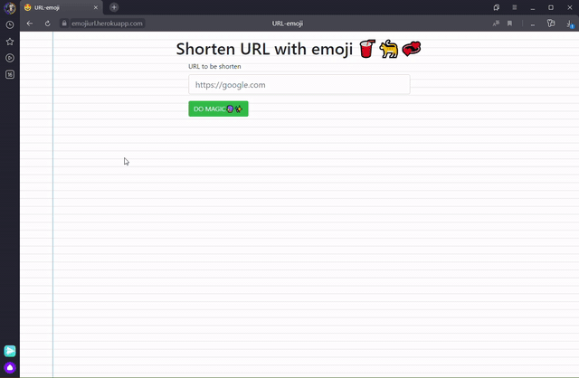

# Shorten URLs with Emojis😊



This is an example of a simple clustered server for NodeJS

`worker.js` \- each  cluster's heavy work

`server.js` \- main server\. Entry point & cluster dispatcher

## Deploy own service in Heroku

* Deploy mongo instance
* [](https://heroku.com/deploy?template=https://github.com/aslepenkov/NodeClusterServer)
* add .env file or config vars in heroku

```
PORT=<PORT>
MONGODB_URI=mongodb://<USER>:<PASS>@<ENDPOINT>:<PORT>/<COLLECTION_NAME>
```
